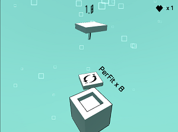

# PerFit 

PerFit is a simple 3D game. There are squares and a panel, for the *Perfect Fit* you should rotate panel, so square can fit to the panel. There are two scores -above one is height of the panel, below one is real score- after every perfect fit these scores inreases. Also there are special squares and every special square has different effect for a while.

- fast square: increase the game speed.

- slow square: reduce the game speed

- square rain: more squares spawn than usual.

- reverse square: left is right, right is left.

- expand sqaure: panel is wider than usual.

- lottery square: after fit that, there are 3 different options. Your score may increase, reduce or game may give you an extra chance.

# LINKS

[> Google Play link](https://play.google.com/store/apps/details?id=com.NordicebearGames.PerFit)
[> Itch.io link](https://nordicebear.itch.io/perfit)

# CREDITS

- All of 3D objects created with Blender.
- All of sounds created by differents artists from [FreeSound](https://freesound.org).

## ʕ•㉨•ʔ